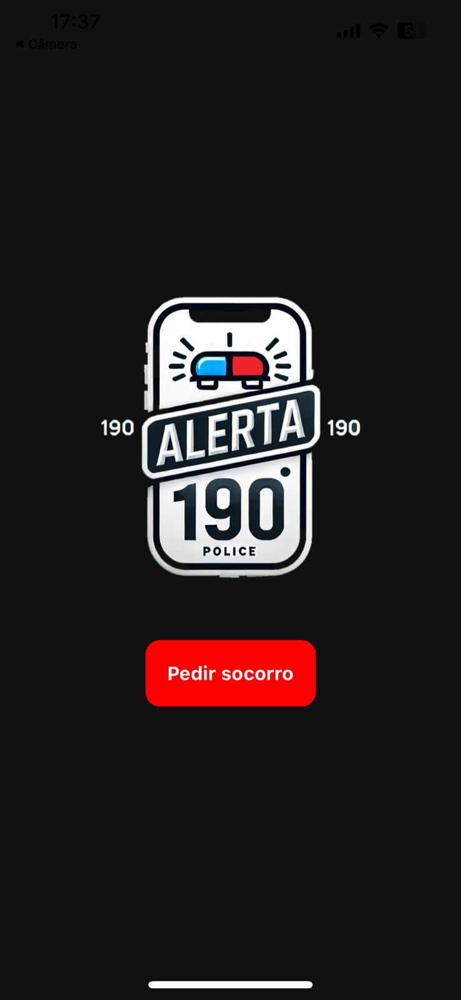

# Aplicativo de Solicitação de Socorro

Este aplicativo permite que os usuários solicitem ajuda rapidamente. Ao abrir o aplicativo, o usuário pode pressionar um botão para preencher um formulário com informações como nome, telefone, localização e observações. Após preencher o formulário, o usuário pode enviá-lo e receber uma mensagem de confirmação.

## Funcionalidades

- Tela inicial com um botão de "Pedir socorro".
- Ao clicar no botão, o formulário é exibido para o preenchimento de informações.
- Formulário com os seguintes campos:
  - Nome
  - Telefone
  - Localização atual
  - Observação
- Após o envio do formulário, uma mensagem de alerta é exibida para o usuário.
- Opção de voltar à tela inicial.

## Tecnologias Utilizadas

- **React Native**: Framework utilizado para o desenvolvimento do aplicativo.
- **useState**: Hook do React utilizado para gerenciar o estado do componente.

## Instalação

1. Clone este repositório:

   ```bash
   git clone <https://github.com/thayannecarrilho/Alerta190>

2. Instale as dependências:
    ```bash
    npm install

3. Execute o aplicativo:
    ```bash
    npx expo start

## Capturas de Tela



## Contribuições
Contribuições são bem-vindas! Sinta-se à vontade para fazer um fork do projeto e enviar pull requests com melhorias, correções de bugs ou novas funcionalidades.
